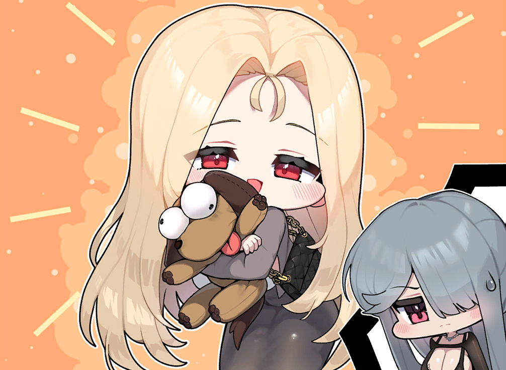

# Brown Dust 2 Assets

This repository contains primarily 2D and Live2D assets from **Brown Dust 2**.

> ⚠️ **Disclaimer:**  
The folder structure in this repository does **not** reflect the actual asset storage structure used in the official game. It is already sorted by me for ease of browsing and accessibility.

## Cloning repository
For faster cloning and saving bandwith, you can use this command to clone which should be fine in most case:

`git clone --depth 1 https://github.com/myssal/Brown-Dust-2-Asset.git`
